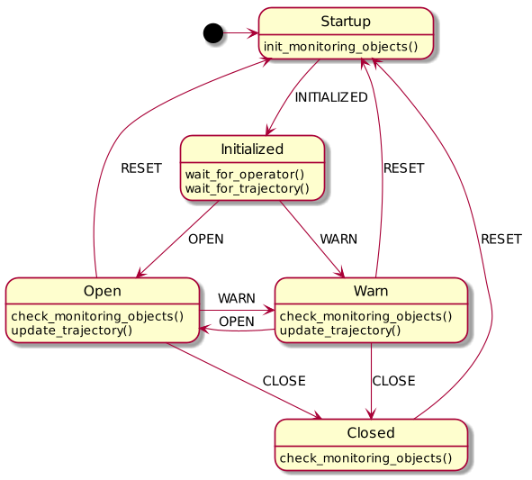

# tod_safety_monitoring

## Dependencies

see `package.xml`

## tod_safety_monitoring (library)

### Basics

Provides a SafetyMonitor, that can easily be used in different nodes. An acceptable timeout for the monitor can be specified using `acceptable_timeout()`. The safety_gate will close if no msg is received within the specified timeout.

```C++
ros::NodeHandle nh;

std::unique_ptr<tod_safety_monitoring::SafetyMonitor> monitor;
monitor = std::make_unique<tod_safety_monitoring::SafetyMonitor>(nh);
monitor->acceptable_timeout(0.5);
```

Two kinds of tests can be performed using the SafetyMonitor:

* **Periodic tests:** Will be executed periodically. E.g., `MaxDurationTest` (see below) will check if the time between two calls of `durationCheckVehData->update()` exceeds 0.1s. If this is the case, an issue with the desired ErrorLvl, key and description is created.

    ``` C++
    std::shared_ptr<tod_safety_monitoring::MaxDurationTest> durationCheckVehData;
    durationCheckVehData = std::make_shared<tod_safety_monitoring::MaxDurationTest>(0.1,
        static_cast<tod_safety_monitoring::ErrorLvl>(2), "key_0", "Duration Test exceeded");

    monitor->add_periodic_test(durationCheckVehData);
    ```

* **Single Tests:** Will be executed once. E.g., `MinValueTest` (see below) will check if val2 is larger than val1 . If this is the case, an issue with the desired ErrorLvl, key and description is created.

    ``` C++
    monitor->perform_test_once(MinValueTest(val1, val2, static_cast<ErrorLvl>(3), "key_1", "The minimum value was exceeded within a test"));
    ```

On call of `on_update()`, the SafetyMonitor will perform all periodic tests and publish all issues on topic `node_state` [tod_safety_monitoring/SafetyState]

```C++
while (ros::ok()) {
    ...
    monitor->on_update();
    ...
}
```

### Create custom tests

Custom tests can be created by extending the Class `SafetyCheck`.

```C++
#include "tod_safety_monitoring/SafetyChecks.h"

struct MyCustomTest : SafetyCheck {
    ...
    bool successfull() const override;
    ...
}
```

## safety_gate (node)

Subscribes to all topics of type `tod_msgs/SafetyState`. Depending on the error level of the received messages, `/trajectory_out` is updated to `/trajectory_in`.
If the trajectory is not updated, the vehicle will finish the last trajectory. The behavior is implemented according to the following state machine:



**Events:**

* `INITIALIZED`: Event is triggered if all mandatory monitoring objects are initialized.

* `OPEN`: Event is triggered if no issues (or only issues with ErrorLvl = OK) exit

* `WARN`: Event is triggered if at least one issue with ErrorLvl = WARNING exists

* `CLOSE`: Event is triggered if at least one issue with ErrorLvl = ERROR exists

* `RESET`: Event is triggered if operator stops the teleoperation session

**Parameters:**

* `debug:` Output additional debugging information to console (Default: false)

* `verbose:` SafetyGate communicates current state and events to console (Default: true)

* `mandatoryTopics:` \<fileName\>.txt (e.g.: config/OperatorMandatoryTopics.txt) with mandatory topics [tod_safety_monitoring/SafetyGate]. The safety_gate wont initialize without those topics (Default: "")

* `namespace_for_safety_issues:` Option to only consider topics [tod_safety_monitoring/SafetyGate] in a specific namespace (Default: "")

**Published Topics:**

* `/trajectory_out` [tod_msgs/Trajectory]
* `gateState` [tod_safety_monitoring/GateState]

**Subscriptions:**

* `.../node_state` [tod_safety_monitoring/SafetyState] 
* `/trajectory_in` [tod_msgs/Trajectory]
* `/status_msg` [tod_msgs/Status]

## OperatorWatchdog

Examplary Watchdog to show the usage of tod_safety_monitoring library. Monitors the age of different topics and creates issues.

**Published Topics:**

* `node_status` [tod_safety_monitoring/SafetyState] 

**Subscriptions:**

* `/Operator/SafeCorridorControl/corridor` [tod_msgs/ColoredPolygon]
* `/Operator/Video/CameraFrontCenter/image_raw` [sensor_msgs/Image]
* `/Operator/Video/CameraFrontRight/image_raw` [sensor_msgs/Image]
* `/Operator/Video/CameraFrontLeft/image_raw` [sensor_msgs/Image]
* `/Operator/VehicleBridge/vehicle_data` [tod_msgs/VehicleData]

## VehicleWatchdog

Examplary Watchdog to show the usage of tod_safety_monitoring library. Monitors the age of different topics and creates issues.

**Published Topics:**

* `node_status` [tod_safety_monitoring/SafetyState] 

**Subscriptions:**

* `/Vehicle/SafeCorridorControl/trajectory_control_command` [tod_msgs/Trajectory]
* `/Vehicle/VehicleBridge/vehicle_data` [tod_msgs/VehicleData]

## Reference

The concept of this packages was published in:

> S. Hoffmann, D. Majstorović and F. Diermeyer
> **"Safe Corridor: A Trajectory-Based Safety Concept for Teleoperated Road Vehicles"**, 
> 2022 International Conference on Connected Vehicle and Expo (ICCVE), 2022, pp. 1-6, doi: 10.1109/ICCVE52871.2022.9742770.

    @INPROCEEDINGS{
    author={Hoffmann, Simon and Majstorović, Domagoj and Diermeyer, Frank},  booktitle={2022 International Conference on Connected Vehicle and Expo (ICCVE)}, 
    title={Safe Corridor: A Trajectory-Based Safety Concept for Teleoperated Road Vehicles}, 
    year={2022},
    pages={1-6},
    doi={10.1109/ICCVE52871.2022.9742770}
    }
